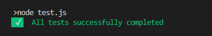

# console-success

[](https://npmjs.org/package/console-success)
[](https://npmjs.org/package/console-success)
[](https://opensource.org/licenses/MIT)
[](https://bundlephobia.com/result?p=console-success)
[](https://github.com/tufantunc/node-console-success)

> A lightweight library that adds a `console.success()` method for logging colored success messages with checkmark icons in both Node.js and browser environments.

## ✨ Features

- 🎨 **Colored output** with green styling and checkmark icons
- 🌐 **Cross-platform** - works in Node.js and browsers
- 📦 **Tiny size** - only 515 bytes (0.31 kB gzipped)
- 🚀 **Zero dependencies** - lightweight and fast
- 🔧 **Easy to use** - simple API, works out of the box

## 📦 Installation

```bash
npm install console-success
```

## 🚀 Usage

### Node.js
```javascript
require('console-success');

console.success('Task completed successfully!');
console.success(new Date()); // Works with any data type
```

### Browser (ES Modules)
```javascript
import 'console-success';

console.success('Hello from the browser!');
```

### Browser (Script Tag)
```html
<script src="https://unpkg.com/console-success@latest/dist/index.js"></script>
<script>
  console.success("Hello world!");
</script>
```

## 🎯 Examples

### Sample Output


### Code Examples
```javascript
// Basic usage
console.success('Operation completed');

// With different data types
console.success(42);
console.success({ status: 'success', data: 'example' });
console.success(['item1', 'item2', 'item3']);

// In async operations
async function fetchData() {
  try {
    const data = await api.getData();
    console.success('Data fetched successfully');
    return data;
  } catch (error) {
    console.error('Failed to fetch data');
  }
}
```

## 📊 Bundle Size

- **Minified**: 515 bytes
- **Gzipped**: 0.31 kB
- **Dependencies**: 0

## 🛠️ Development

```bash
# Install dependencies
npm install

# Run tests
npm run test

# Run E2E tests
npm run test:e2e

# Build
npm run build

# Run all tests
npm run test:all
```

## 📄 License

MIT © [Tufan Tunç](https://tufantunc.com)

## 🔗 Links

- [Live Demo](https://codepen.io/tufantunc/pen/XWbggaa)
- [GitHub Repository](https://github.com/tufantunc/node-console-success)
- [NPM Package](https://npmjs.org/package/console-success)
